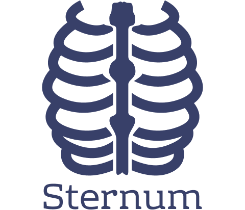

  

Sternum Configuration Server
============================
Sternum configuration server is microservice for serving configuration files to other microservices from within home directory. It is entirely based on Spring Cloud Config Server.

It is available as a docker image and that should be the primary way of using it.

Serving Configuration
---------------------
Configuration files should be named with the following pattern:

`[application_name]-[application_profile].properties`

e.g. myapp-prod.properties

File above should be served at `/myapp/prod`.

Usage with Docker
-----------------
Image can be pulled from `mdud/sternum-config`. To provide config files mount volume to `/root/config/` directory of the container. Example for starting service with docker-compose is provided in the `example` dir.

Development
-----------
Service is not dependent on other services therefore modifiying the source code should not cause much trouble. For convenience there is Vagrantfile provided for deploying development environment.
